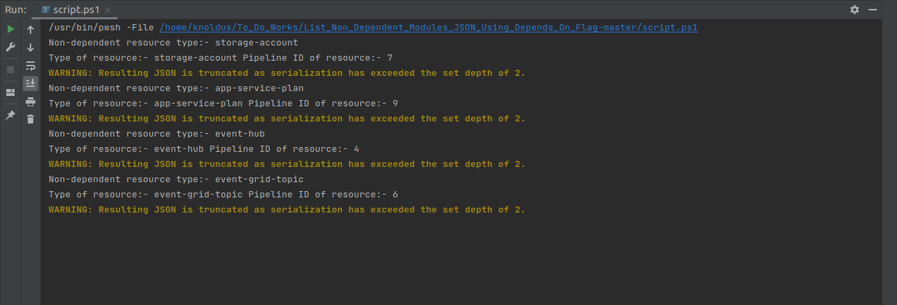
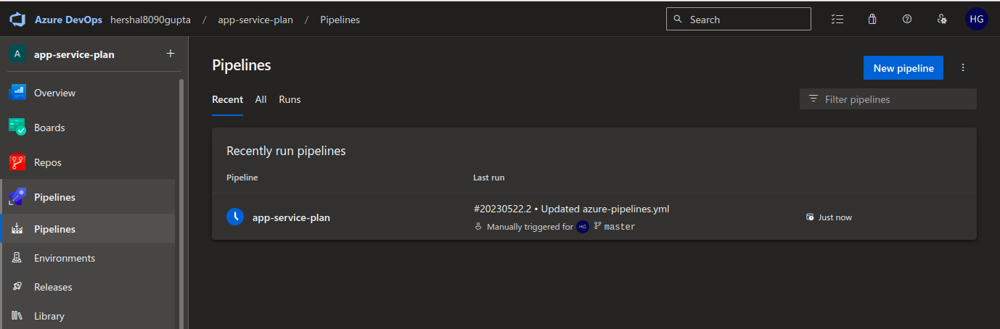
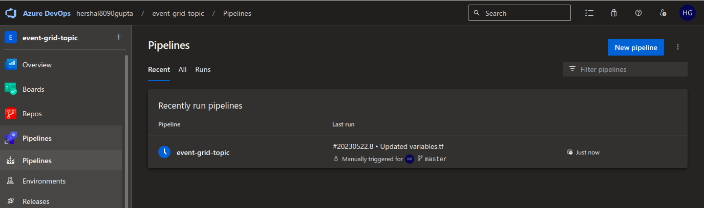
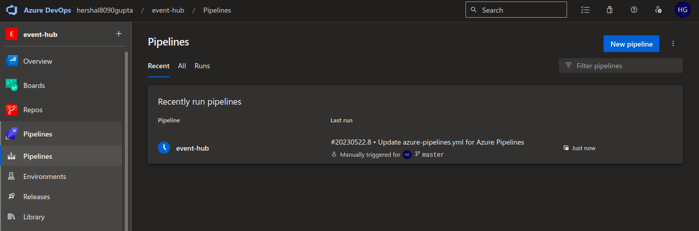
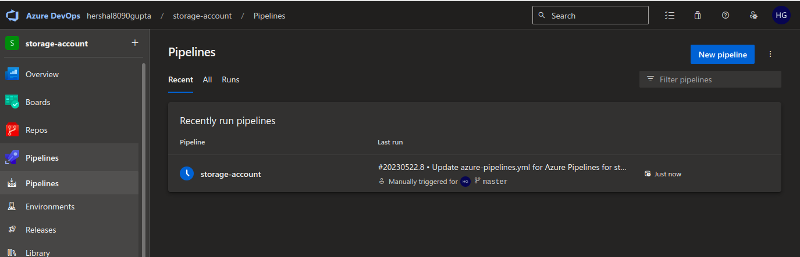

## Description

In this template, We will Invoke the multiple ADO Pipelines using the pipeline ID and resource type and using the api with the switch cases in powershell script.

---

### Steps
* Provide with the necessary details like ADO Pat token , Organisation name and File paths to run the script.
* Run the powershell script from any IDE or using `./<script-name>.ps1` in terminal.
* Start the Agent , to call ADO pipeline 

---

### Outputs

1. Executing the script :

2. Calling the pipeline on ADO for app service plan :

3. Calling the pipeline on ADO for event grid topic :

4. Calling the pipeline on ADO for event grid topic :

5. Calling the pipeline on ADO for storage account :

---